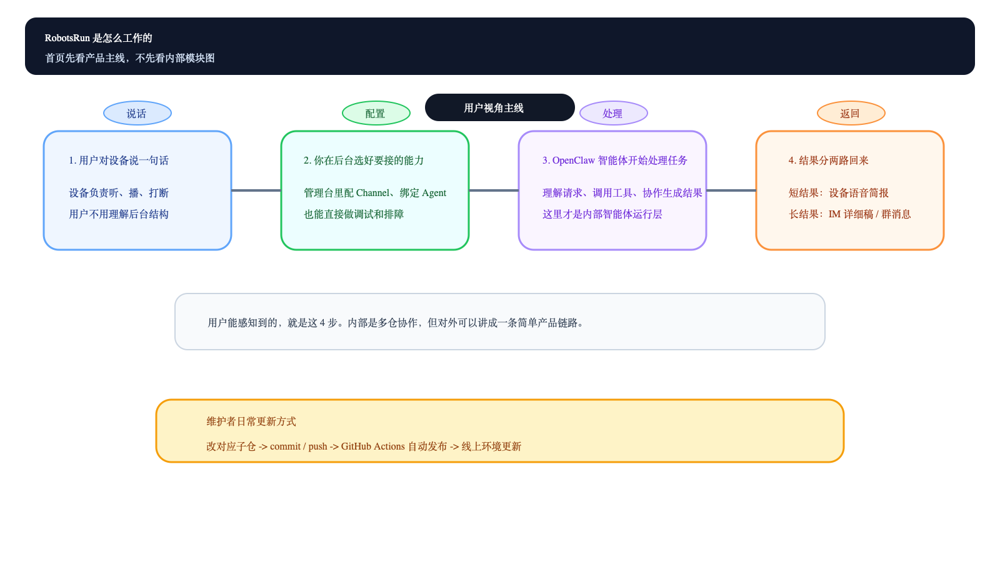
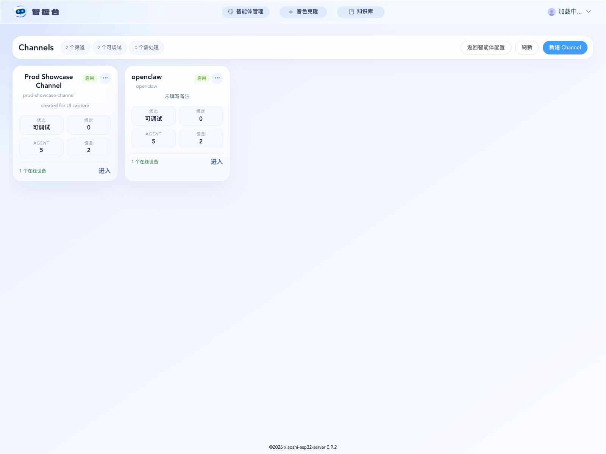
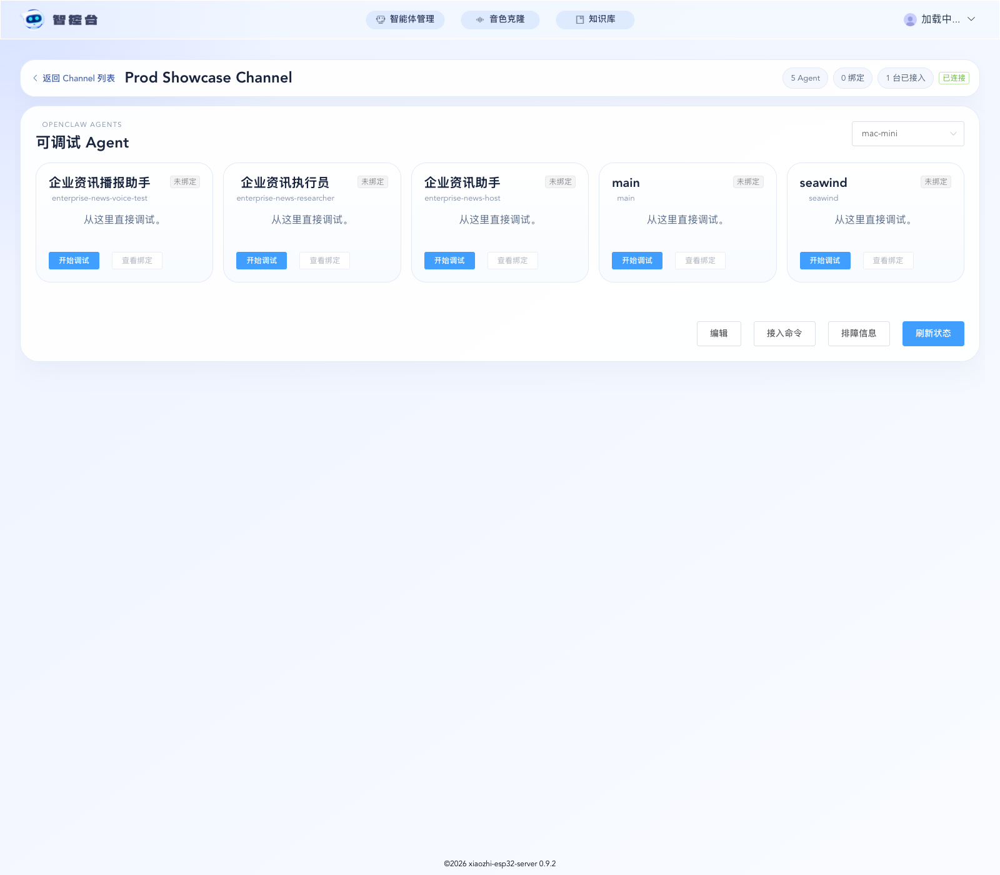
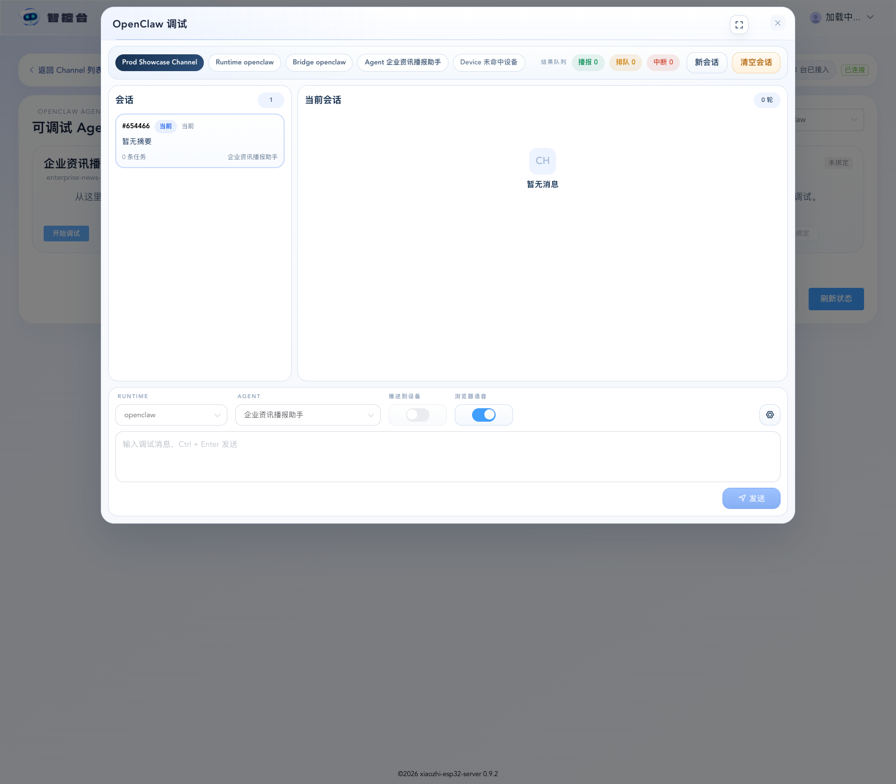
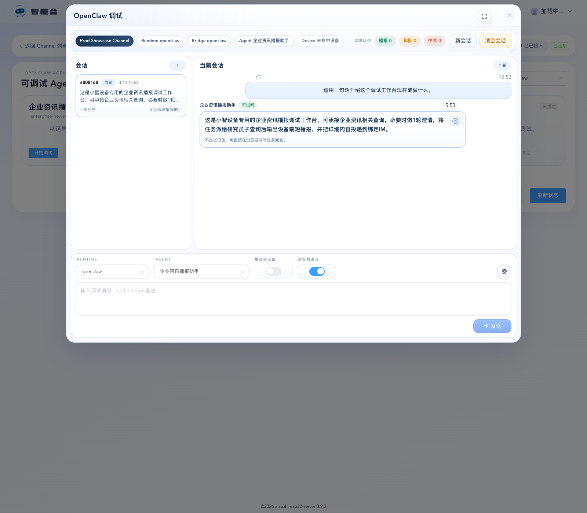

# RobotsRun

很多人第一次玩小智，喜欢的其实不是“大模型”这四个字，而是那种很直接的感觉：桌上放一个设备，你说一句，它就回一句。这件事本身就挺好，所以如果你只是想做一个普通语音对话版小智，原版链路通常已经够用了。

问题出在下一步。你开始不满足于“问一句答一句”，而是希望它真的去做点事。比如听到一句话之后，不是马上回你一句套话，而是把任务交给 OpenClaw，在后台查、跑、整理，过一会儿再把结果带回来。走到这里，事情就不再只是“把模型接到硬件上”这么简单了。

因为 OpenClaw 很强，但它本来不是一个硬件入口；小智很自然，但它原本也不是按后台长任务来设计的。两边单看都没问题，真要接在一起，中间就会冒出一堆很现实的麻烦：任务晚回来怎么办，多个结果先播哪个，subagent 的过程去哪看，长结果怎么处理，用户开口打断时又该怎么算，完整内容是不是要发到 IM。

`RobotsRun` 做的就是这一层脏活。它把小智放在前面，让人能自然开口；把 OpenClaw 放在后面，让任务真的跑起来；再把服务端桥接、调试台、异步回传、排队播报、IM 详细稿这些原来缺着的环节补齐。做完之后，小智就不只是一个会聊天的盒子，而是一个能接任务、等结果、再把结果带回来的 AI 硬件入口。

## 先把两件事讲明白

### 小智是什么

对大多数人来说，小智最吸引人的地方很简单：不用盯着聊天窗口，直接对着一个设备说话。它天生适合陪聊、普通问答、语音助手这种“一问一答马上回”的场景。

### OpenClaw 是什么

OpenClaw 更像后台大脑。它擅长接住一个任务，然后去调工具、跑流程，必要时再拆 subagent 处理子问题。它的结果不一定马上回来，但更有机会把事情真的做完。

## 原版小智为什么会开始不够用

只做即时语音对话的时候，原版小智没什么问题。可一旦你想让它接 OpenClaw，几个问题会马上变得很现实。

- 任务不是每次都能立刻结束，设备要怎么等结果
- 一个任务里可能还会继续拆 subagent，过程和结果怎么分清
- 多个结果回流时，设备先播哪个，能不能乱抢
- 语音只能讲摘要，长结果往哪儿放才不难受
- 出问题的时候，后台能不能一眼看出是绑定错了、任务卡了，还是播报没发出去

这些问题其实都不是“模型能力”问题，而是产品链路问题。

## 接上 OpenClaw 之后，能力到底变了什么

接上 OpenClaw 以后，小智就不再只是“听一句回一句”的聊天设备了。它更像一个前台入口：人说一句话，设备把任务往后送，OpenClaw 在后台把活跑完，结果回来之后，再用合适的方式交还给人。

这带来的变化很直接：

- 它可以承接后台任务，而不是只做即时问答
- 它可以调用工具、跑多步流程，而不只是生成一句回复
- 它可以等结果回来，再决定怎么播、怎么展示
- 它可以把短结果说给人听，把长结果发到 IM 里留档

换句话说，原版小智更像“语音聊天”，接上 OpenClaw 之后才开始有“执行能力”。

## 为什么后来又补了队列、subagent、IM 和调试台

这些东西看起来像“优化项”，其实不是。只要你真的让设备去接后台任务，它们就是基本盘。

### 异步等待和结果回传

后台任务不是每次都能立刻结束。如果没有 async waiting 和 async auto-push 这条链，设备其实接不住真正的后台执行结果。

### subagent trace

复杂任务不一定是一个 Agent 一口气做完。中间一旦拆出 subagent，如果你看不见它们的完成状态和过程，调试时基本就只能靠猜。

### 严格排队播报

设备扬声器只有一个。多个结果如果一回来就互相抢播，体验会直接崩掉。所以后面才会明确收口成一句规则：

> 所有结果严格排队，只有设备侧语音主动打断是例外。

### IM 详细稿

语音适合播摘要，不适合播整段长文。所以后来才补了“语音简报 + IM 详细稿”双通道，让设备负责说重点，IM 负责留全文。

### debug workbench

只要系统里出现后台任务、subagent、异步返回、浏览器试听和设备播报，原来那种只看最后一句回复的调试方式就完全不够用了。后面连续补 channel management、web debug console、runtime workbench、trace flow、delivery binding 和 playback queue，都是为了让这套东西真的能查、能调、能交付。

## 这个仓库到底解决了什么

说得直白一点，`RobotsRun` 解决的是这件事：

让“小智这个会听会说的硬件”，和“OpenClaw 这个会在后台干活的 Agent 系统”，不只是勉强连上，而是能稳定配合起来。

具体一点：

- 小智负责前台入口，让人自然开口
- OpenClaw 负责后台执行，把任务真的做完
- 服务端负责桥接、结果回传和设备会话
- 管理后台负责配置、绑定、调试和排障
- 语音负责播简报，IM 负责收详细稿

## 你适不适合看这个仓库

| 你想做什么 | 更适合什么 |
| --- | --- |
| 做一个普通语音聊天版小智 | 原版小智 |
| 在电脑里直接跑 OpenClaw 聊天或自动化 | 直接用 OpenClaw |
| 做一个会说话、会接后台任务、还能把结果稳定带回来的 AI 硬件入口 | 看 `RobotsRun` |

## 它是怎么工作的

这张图只讲产品主线，不展开内部模块细节。

[](docs/images/robotsrun-how-it-works.svg)

可编辑源文件：[`docs/images/robotsrun-how-it-works.drawio`](docs/images/robotsrun-how-it-works.drawio)  
矢量版：[`docs/images/robotsrun-how-it-works.svg`](docs/images/robotsrun-how-it-works.svg)

如果你想看内部模块关系，再看技术补充图：
[技术架构图](docs/images/robotsrun-architecture.svg)

## 最省事的开始方式

如果你现在的目标只是“先跑起来看看值不值得继续折腾”，不要先研究架构图，按下面做就够了。

### 1. 克隆仓库

这个仓库依赖子仓，必须带 `submodule` 拉取：

```bash
git clone --recurse-submodules https://github.com/GalaxyXieyu/RobotsRun.git
cd RobotsRun
```

如果你已经 clone 过但没拉子仓，补一次：

```bash
git submodule update --init --recursive
```

### 2. 检查本地依赖

```bash
./scripts/dev-stack.sh doctor
```

至少建议具备这些基础环境：

- Docker
- Node.js / npm / pnpm
- Python 3
- JDK 21
- Maven 3.8+
- `ffmpeg`
- `openclaw` CLI

其中 `openclaw` CLI 只有在你要联调 OpenClaw 时才是必需项。

### 3. 一键拉起整套本地环境

```bash
./scripts/dev-stack.sh quick-up
```

启动完成后，默认入口如下：

- 管理台：`http://127.0.0.1:8002`
- API 文档：`http://127.0.0.1:8002/xiaozhi/doc.html`
- WebSocket：`ws://127.0.0.1:8000/xiaozhi/v1/`
- `xiaozhi-server` HTTP / OpenClaw admin / bridge：`http://127.0.0.1:8003`

如果你只是要快速体验后台和基础联调，到这里就已经够了。

关闭环境：

```bash
./scripts/dev-stack.sh quick-down
```

## 想源码调试，按这个顺序

如果你要改代码、断点调试、看 OpenClaw 真实链路，不要继续用整套容器黑盒跑，建议直接切源码模式。

### 1. 先只起 MySQL / Redis

```bash
./scripts/dev-stack.sh db-up
```

### 2. 本地跑管理 API

```bash
./scripts/dev-stack.sh run-api
```

### 3. 本地跑管理台

```bash
./scripts/dev-stack.sh run-web
```

默认访问：

- 本地管理台：`http://127.0.0.1:8001`

### 4. 配好 `xiaozhi-server` 再启动

先准备配置文件：

```bash
cd xiaozhi-esp32-server/main/xiaozhi-server
cp config_from_api.yaml data/.config.yaml
```

至少确认这几项配置已经对齐：

- `manager-api.secret`
- `server.secret`
- `server.websocket`
- `server.ota`

最常见的问题就是 `manager-api.secret` 不一致，导致后台和 runtime 漂移。

然后启动：

```bash
cd ../../..
./scripts/dev-stack.sh run-server
```

如果还要调移动端 H5：

```bash
./scripts/dev-stack.sh run-mobile-h5
```

源码调试结束后，关闭 DB / Redis：

```bash
./scripts/dev-stack.sh db-down
```

## 想把 OpenClaw 接进来

推荐顺序固定，不要跳步：

1. 先把 `xiaozhi-server`、`manager-api`、`manager-web` 跑起来
2. 进入管理台的 OpenClaw 管理页，先保存 channel
3. 用页面里的 setup guide 生成安装命令
4. 在 OpenClaw 本地目录执行安装命令，让 bridge 接入 `xiaozhi-server`
5. 回管理台做 inventory 同步
6. 回 Agent 配置页，把 `agentType` 切成 `openclaw`
7. 选择 `channelId / runtimeAccount / openclawAgentId`
8. 保存后用 direct chat / debug workbench 做验证

别反着来。先乱装 bridge 再补后台配置，最后通常只会让你分不清问题到底在 channel、inventory、agent binding 还是 runtime。

## 生产界面展示

下面这批截图不是本地 mock，而是 2026-04-13 从真实生产环境补的展示留档。

- 生产入口：`https://dkyyznecfvae.sealoshzh.site/#/openclaw-management`
- 证据索引：[`.planning/ui/evidence/2026-04-13-openclaw-debug-console/README.md`](.planning/ui/evidence/2026-04-13-openclaw-debug-console/README.md)
- 生产说明：[`.planning/ui/evidence/2026-04-13-openclaw-debug-console/production-capture-2026-04-13.md`](.planning/ui/evidence/2026-04-13-openclaw-debug-console/production-capture-2026-04-13.md)

| Channel 首页 | Channel 详情工作台 |
| --- | --- |
|  |  |

| 调试弹窗 | 调试弹窗含真实回复 |
| --- | --- |
|  |  |

## 仓库结构

- `xiaozhi-esp32/`
  设备固件、板卡适配、设备侧 OTA / WebSocket / MQTT。
- `xiaozhi-esp32-server/`
  服务端主仓：
  - `main/xiaozhi-server`：Python runtime，负责设备会话、语音链路、OpenClaw bridge hub
  - `main/manager-api`：Spring Boot 管理 API
  - `main/manager-web`：Vue 2 管理台
  - `main/manager-mobile`：uni-app 移动管理端
- `openclaw-xiaozhi/`
  OpenClaw 的 xiaozhi channel 插件和安装 CLI。
- `deploy/`
  只保留早期 Sealos 拓扑和冷启动参考，不是日常发布入口。

## 我们做了哪些关键二开

### 1. 统一 Agent 模型

- 用 `agentType = native | openclaw` 区分运行来源
- 公共字段继续复用原有 Agent 管理流
- `openclaw` 类型只处理 channel / runtime / agent 绑定，不再额外暴露第二套 prompt 心智

### 2. 补齐 OpenClaw 管理后台

- 配置 channel
- 生成 setup guide / 安装命令
- 同步 inventory
- 查看 runtime / account / agent 可选项
- direct chat 在线调试
- clear session 清理调试会话

### 3. 把调试台做成可读工作台

- 每次调试请求按 task 展示
- 处理过程和最终回复拆开看
- 支持查看执行过程、当前回复、浏览器试听、设备播报状态
- 支持按会话回看历史任务，不只是盯最后一条消息

当前调试台的核心产品口径已经收口为：

> 所有结果严格排队，只有设备侧语音主动打断是例外。

### 4. 补了“语音简报 + IM 详细稿”双通道投递

- `简报` 回到设备端播报
- `详细稿` 通过 OpenClaw outbound message 投递到绑定的 IM 会话
- 服务端负责保存并透传 `deliveryBinding`
- 插件侧补齐 `xiaozhi_push_text` 与 `xiaozhi_deliver_detail`

### 5. 把联调入口收口成统一脚本

统一入口都在：

```bash
./scripts/dev-stack.sh help
./scripts/dev-stack.sh doctor
./scripts/dev-stack.sh quick-up
./scripts/dev-stack.sh quick-down
./scripts/dev-stack.sh db-up
./scripts/dev-stack.sh db-down
./scripts/dev-stack.sh run-api
./scripts/dev-stack.sh run-web
./scripts/dev-stack.sh run-server
./scripts/dev-stack.sh run-mobile-h5
./scripts/dev-stack.sh smoke-router
./scripts/dev-stack.sh smoke-direct
```

## 发布真相

这部分很重要，因为这个项目以前最容易在这里走偏。

- 生产环境只允许在对应子仓改代码
- 改完后只允许 `commit -> push -> GitHub Actions 部署`
- 不允许再用 `kubectl cp`、ConfigMap 覆盖源码、手改容器启动命令这种旁路热修

当前生产发布的真实仓库是 `xiaozhi-esp32-server` 的 `galaxy/main`。

- `xiaozhi-server` 改动，走 `xiaozhi-esp32-server` 子仓工作流
- `manager-api / manager-web` 改动，也走 `xiaozhi-esp32-server` 子仓工作流
- `openclaw-xiaozhi` 的改动不会自动替换线上服务端镜像
- 根仓 `deploy/` 只保留历史参考，不是日常发布入口

## 设备端编译 / 烧录

如果你要改固件，请进入 `xiaozhi-esp32/` 按 ESP-IDF 流程执行：

```bash
cd xiaozhi-esp32
idf.py build
idf.py -p <your-port> flash
```

当前这台开发机已经额外准备了一套仓库私有 ESP-IDF 环境，供本地烧录回归使用；如果你是在别的环境接手，优先先确认本机的 ESP-IDF 配置，而不是直接照搬机器私有路径。

## 团队协作约定

后续继续在这个项目上迭代，默认按下面做：

1. 先在 PM 里创建任务，不要直接裸改
2. 每个任务完成后，按子仓正常 `commit + push + 自动部署`
3. 如果涉及 server / manager 界面修改，要补 UI/UX 测试截图留档

## 常用命令速查

```bash
./scripts/dev-stack.sh doctor
./scripts/dev-stack.sh quick-up
./scripts/dev-stack.sh quick-down
./scripts/dev-stack.sh db-up
./scripts/dev-stack.sh db-down
./scripts/dev-stack.sh run-api
./scripts/dev-stack.sh run-web
./scripts/dev-stack.sh run-server
./scripts/dev-stack.sh run-mobile-h5
./scripts/dev-stack.sh smoke-router
./scripts/dev-stack.sh smoke-direct
```
